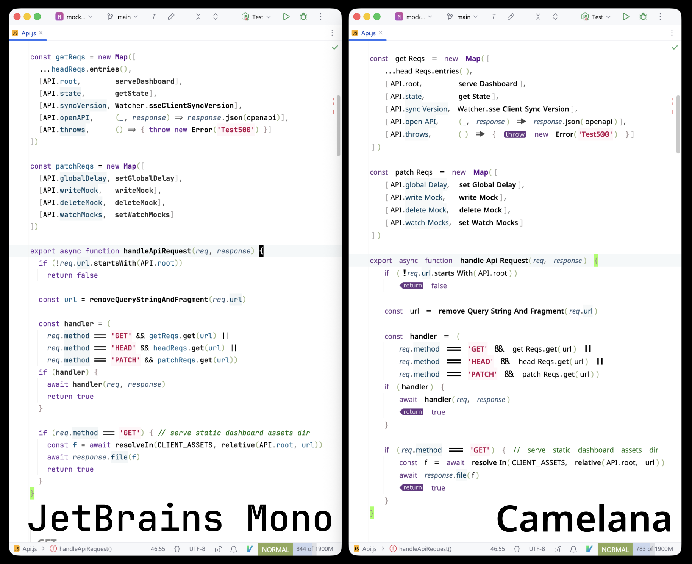
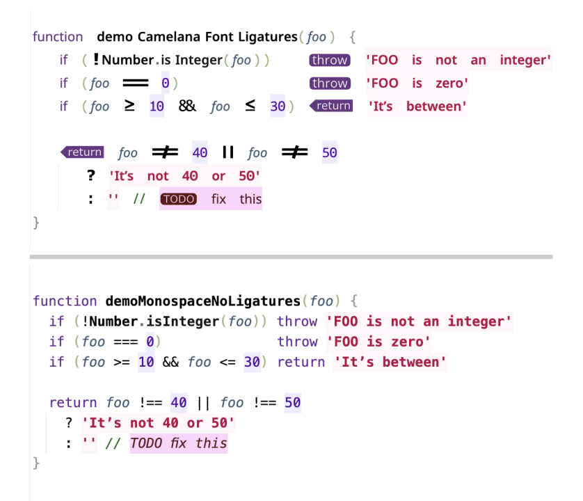
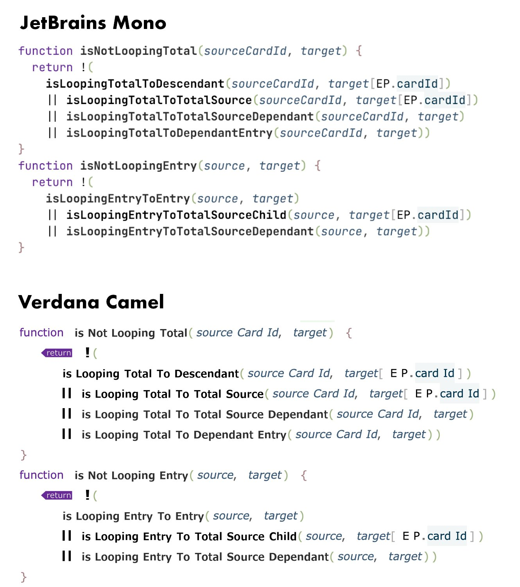

# Camelana (2026 Version)
Camelana is a proportional coding font.

Here‘s a side-by-side with one of the most legible monospace typeface.
The IDE on the picture uses [Tabular Eye](https://github.com/ericfortis/tabular-eye),
which renders code in columns without adding whitespace.

## Features
Besides common coding ligatures, this font has a little bit of left padding
on uppercase letters when they are part of a CamelCase identifier.
So to avoid confusion, the normal space glyph is much wider. It takes about
10 minutes to get used to that extra padding.

Also, `!`, `?`, and `:` are oversized so it's easier to spot them.

`return`, `throw`, and `TODO` have a solid background.

### Release notes
- This new version is based on Noto Sans, which is nearly identical to Verdana.
- The `return` (and the new `throw`) ligatures are now context aware, so words such as `returned` don't get the replacement.
- The left padding on uppercase letters is now context aware, e.g., SCREAMING_CASE identifiers don't get the replacement.
 
### Docs
The [docs/](/docs) folder explains how it was done.

---

## VerdanaCamel (2016 Version)

