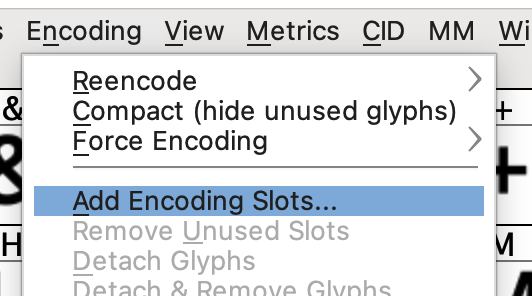
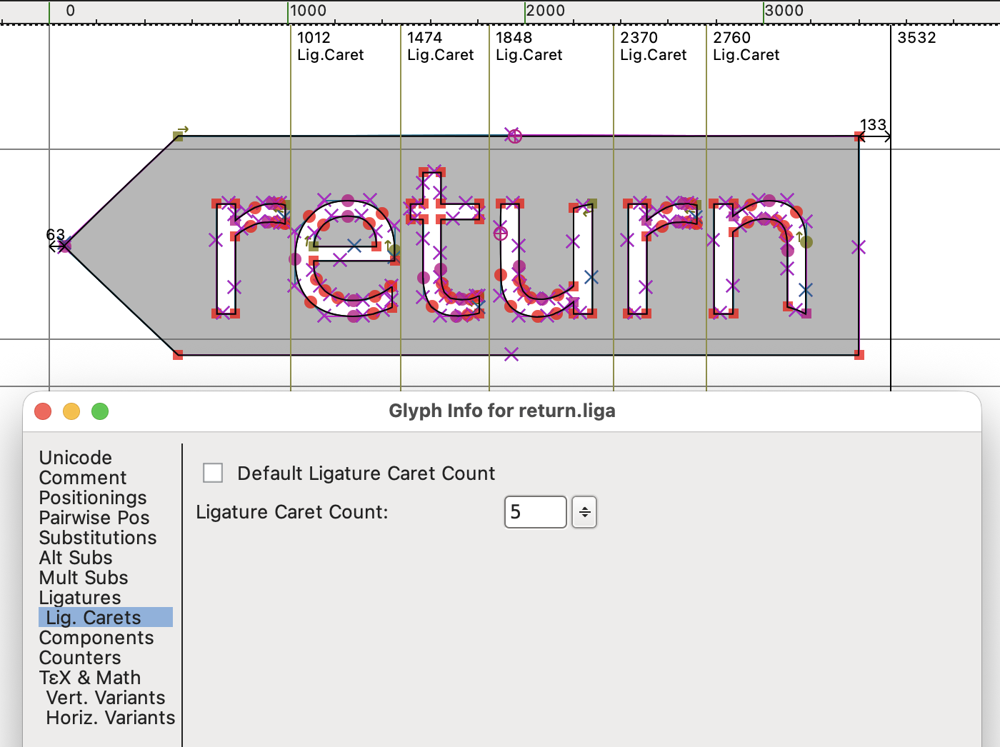
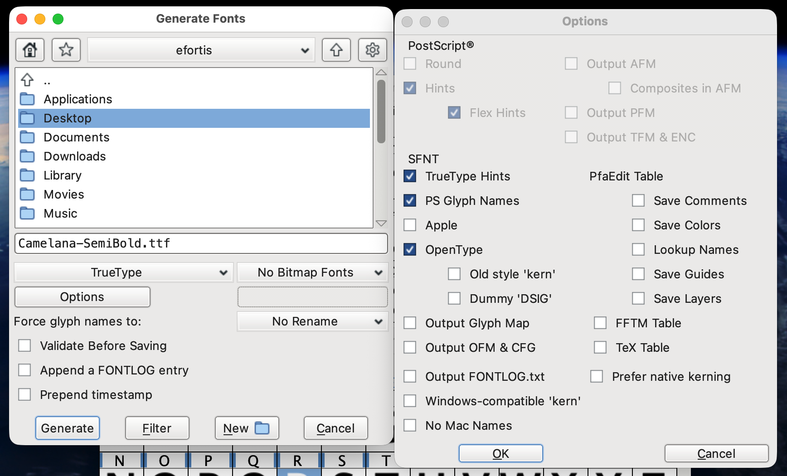

# Making Camelana

## 1. Download Noto Sans
https://fonts.google.com/noto/specimen/Noto+Sans

Unzip it in the `scripts/` folder at the root of this repo, so you'll end up with:
```sh
scripts/Noto_Sans/static/NotoSans-*.ttf
```

## 2. Camelize
This step programmatically:
- Widens the space char (4x)
- Adds new uppercase glyphs with `0.33*new_space_width` of left padding. The new glyphs 
are called the same but with a `.lpad` suffix. 
- Just for testing, at this point we also create their substitution rule, which is: 
use the new-padded uppercase glyph when the preceding glyph is a lowercase letter.
We reinject that same rule later on in **Step 6.**

See [camelize.py](../scripts/camelize.py)

## 3. Tweak glyphs 
Tweak chars that don't look good in code. e.g., 0, 1, brackets, slashes, ?, :

e.g., scale up the `?` `:` chars, and add some padding to chars that look crowded.


## 4. Draw ligature glyphs
This is just injecting the new glyphs (not registering them). 
Although we can use FontForge to register them,
it's much faster to edit them in a `.fea` file (**Step 6**)

### Inserting a new glyph
**FontForge > Encoding > Add Encoding Slots**



Then double-click the last slot, which is now empty.


It's easier to draw in Inkscape, so there we create
a 1000&times;1000px document, with a guideline at 800px.

What matters is to keep a consistent height, those 1000px
will become 1em. The guideline is the baseline.


Export it as **Plain SVG**. Then in FontForge,
after double-clicking the new slot, **File > Import**.

_As a tip, it's handy to see the padding distances, FontForge > View > Show > Side Bearings_

### Ligature carets
Add guidelines in the places you want the carets to be placed.



### Export caret definitions
After you are done with all the ligatures **Element > Font Info > Lookups > Right-Click any entry > Save Feature File**


## 5. Export TTFs
**File > Generate Fonts**, use these options:




## 6. Register ligatures
https://learn.microsoft.com/en-us/typography/opentype/spec/features_ae

In the scripts folder there is a [Camelana-Regular.fea](../scripts/Camelana-Regular.fea) file,
which also has the rules we added in Step 1 (`calt`). That's mainly because it's easier
to replace all features than to merge them. Well, merging is easy
in FontForge > File > Merge Feature Info. What's not easy
is debugging rules that don't merge well. 

See [replace_fea.py](../scripts/replace_fea.py)