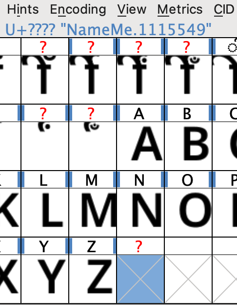
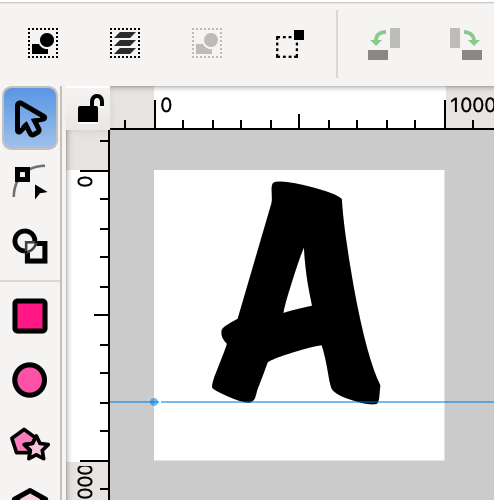

# Making Camelana

## 1. Download Noto Sans
https://fonts.google.com/noto/specimen/Noto+Sans

Unzip it in this directory, you'll end up with:
```sh
scripts/Noto_Sans/static/NotoSans-*.ttf
```

## 2. Camelize
This step programmatically:
- Widens the space char (4x)
- Adds new uppercase glyphs with `0.33*new_space_width` left padding. The New glyphs 
are called the same but with a `.lpad` suffix. 
- Just for testing, at this point we also create their substitution rule, which is: 
use the new-padded uppercase glyph when the preceding glyph is a lowercase letter.
We reinject that same rule later on in **Step 6.**

```sh
make setup
make camelize
```

## 3. Tweak glyphs 
Tweak chars that don't look good in code. e.g., 0, 1, brackets, slashes, ?, :

e.g., scale up the `?` `:` chars, and add some padding other chars that look to crowded.


## 4. Draw ligature glyphs
This is just injecting the new glyphs (not registering them). For the most part, only in 
the Regular weight. 

Although we can use FontForge to register them,
it's much faster to edit them in a `.fea` file (**Step 6**)

#### Inserting a new glyph
FontForge -> Encoding -> Add Encoding Slots


Then double-click the last slot, which is now empty.



It's easier to draw in Inkscape, so there we create
a 1000x1000px document. Add a guideline at 800px.

What matters is to keep a consistent height, those 1000px
will become 1em. And the guideline is the baseline.



Export it as Plain SVG, and then in FontForge,
after double-clicking the new slot, File -> Import.
Tip, it's handy to see the padding distances, View -> Show -> Side Bearings

### Ligature carets
Add guidelines in the places you want the carets to be placed.


## 5. Export TTFs
File -> Generate Fonts -> Use these options:


## 6. Register ligatures
https://learn.microsoft.com/en-us/typography/opentype/spec/features_ae

In this folder there is a `.fea` file, which also has the rules
we added in Step 1 (`calt`). That's mainly because it's easier
to replace all features than to merge them. Well, merging is easy
in FontForge -> File -> Merge Feature Info. What's not easy
is debugging rules that don't merge well. 

```sh
make replace-fea
```